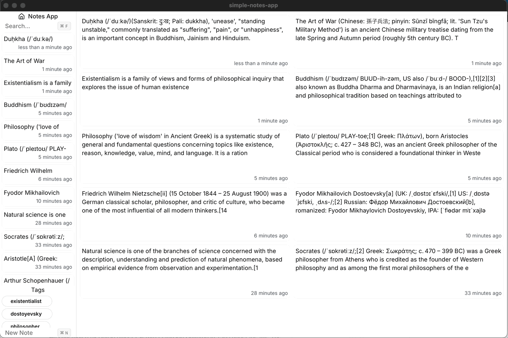

# Simple Notes App with Sentence Transformers

A simple offline notes app using all-minilm-l6-v2 to encode notes, storing the vectors in sqlite-vss for search.
Built with Tauri, Next.js, Tailwind, sqlx, SQLite, rust-bert. Notes and encoding are all offline so there's no risk of leaking personal information.

# Demo

